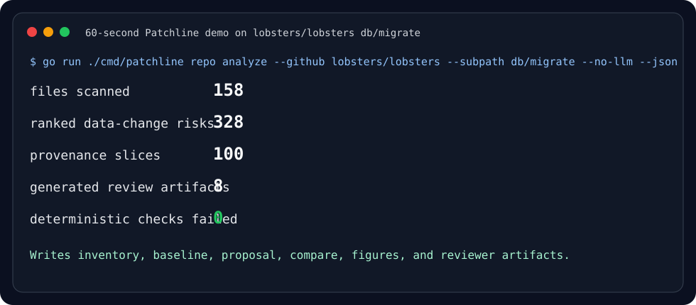

# Patchline

Patchline is a deterministic checker for the data-change material teams already have: GitHub repos, migration directories, service source trees, telemetry exports, JSON logs, incident notes, and repair scripts.

It is not an AI tool, and it does not require you to label data or adopt a Patchline-specific format first. Point it at existing files; it inventories what is there, finds risky changes across SQL migrations, NoSQL stores, data pipelines, protobuf/Avro schemas, and infrastructure ordering, and prints the next commands that can run immediately.

[](#60-second-demo)
[](#why-this-is-useful)
[](#real-public-repo-output)
[](docs/reviewer-walkthrough.md)
[](docs/artifact-badges.md)
[](docs/artifact-badges.md)
[](docs/artifact-badges.md)
[](docs/artifact-badges.md)

## 60-second demo

Install:

```bash
go install github.com/thehalleyyoung/patchline/cmd/patchline@latest
# or from a checkout:
go build -o bin/patchline ./cmd/patchline
```

Run Patchline on a real public migration directory, report ranked data-change risks, and keep generated code quarantined:

```bash
go run ./cmd/patchline repo analyze \
  --github lobsters/lobsters \
  --ref 3b80b47aa5aaba37ec44413e7d1dc96fcf1585b6 \
  --subpath db/migrate \
  --stages inventory,baseline,propose,compare \
  --proposal-kind all \
  --budget files=8,lines=100,tokens=12000,changes=2 \
  --no-llm \
  --out results/generated/landing-demo \
  --json
```



### Real public-repo output

`make landing-readme-gate` regenerates this from pinned `lobsters/lobsters` code.

| Public slice | Files scanned | Ranked data-change risks | Provenance slices | Generated review artifacts | Deterministic checks failed |
| --- | ---: | ---: | ---: | ---: | ---: |
| `lobsters/lobsters` `db/migrate` | 158 | 328 | 100 | 8 | 0 |

```bash
go run ./cmd/patchline intake . --out results/generated/intake
go run ./cmd/patchline intake --github owner/repo --subpath path/to/migrations --out results/generated/intake
```

If you want a reproducible local workspace first, fetch and inventory the repo before intake:

```bash
go run ./cmd/patchline repo fetch django/django \
  --subpath django/contrib/auth/migrations \
  --out results/generated/repos/django-auth
go run ./cmd/patchline doctor --github django/django \
  --subpath django/contrib/auth/migrations \
  --out results/generated/repos/django-auth-doctor
go run ./cmd/patchline quickstart --github django/django \
  --subpath django/contrib/auth/migrations \
  --out results/generated/repos/django-auth-quickstart
go run ./cmd/patchline repo analyze --github django/django \
  --subpath django/contrib/auth/migrations \
  --stages inventory,baseline,propose,compare,deep \
  --budget files=15,lines=120,tokens=50000,changes=3 \
  --redact \
  --no-llm \
  --out results/generated/repos/django-auth-analysis
go run ./cmd/patchline repo inventory \
  results/generated/repos/django-auth/django-django-*/django/contrib/auth/migrations \
  --out results/generated/repos/django-auth-inventory

go run ./cmd/patchline intake \
  results/generated/repos/django-auth/django-django-*/django/contrib/auth/migrations \
  --out results/generated/repos/django-auth-intake

go run ./cmd/patchline repo baseline \
  --inventory results/generated/repos/django-auth-inventory \
  --intake results/generated/repos/django-auth-intake \
  --out results/generated/repos/django-auth-baseline

go run ./cmd/patchline repo propose \
  --from-report results/generated/repos/django-auth-baseline \
  --proposal-kind all \
  --budget files=15,lines=120,tokens=50000,changes=3 \
  --out results/generated/repos/django-auth-proposal

go run ./cmd/patchline repo compare \
  --before results/generated/repos/django-auth-baseline \
  --after results/generated/repos/django-auth-proposal \
  --out results/generated/repos/django-auth-compare

go run ./cmd/patchline repo hook pre-commit --root . --json
go run ./cmd/patchline repo hook pre-push --root . --base origin/main --json
go run ./cmd/patchline repo offline --analysis results/generated/repos/django-auth-analysis --json
```

Quickstart writes `quickstart.json`, `quickstart.md`, and `commands.sh` with exactly three copy/paste commands plus expected artifacts. Doctor writes `doctor.json` and `doctor.md` with tool availability, cache state, scanned files, facts, and safe native checks before analysis. Fetch writes `source.json` with source provenance, resolved GitHub commit, archive hash, timestamp, tool version, and cache metadata. Inventory writes `inventory.json`, `inventory.md`, `facts.jsonl`, and `project-map.md`. Baseline writes `baseline.json`, `baseline.md`, and `baseline.sarif`, including ranked risks, invariant candidates, privacy/lock hazards, blast-radius estimates, proof-hole minimizations, and trace-to-code links from OpenTelemetry, Datadog-style exports, structured logs, deploy markers, and incident timelines. Propose writes `prompt-context.json`, `prompt.txt`, `proposal.patch`, `proposal.json`, and generated untrusted artifacts under `patchline-proposals/`. Compare writes `compare.json` and `compare.md`. Triage writes `triage/triage.json` and `triage/triage.md`, also copied into `analysis-bundle/`, grouping findings by maintainer owner surface. See [docs/architecture.md](docs/architecture.md) for the fetch, inventory, intake, baseline, proposal, compare, deep-analysis, and gate layer contract.

`repo analyze` also writes `commands.md`, a copy/paste maintainer report with the equivalent one-command and staged command sequences plus the shareable bundle paths.

To plug in a local or hosted generator, pass `--llm-command '<cmd>'`; Patchline sends the prompt on stdin and stores the output as an untrusted artifact for deterministic compare. Use `--no-llm` when you want template-only analysis and rejection of any generator command.

Use `--budget files=N,lines=N,tokens=N,changes=N` to bound generated scope before a patch is written. `changes` limits targeted risks, `files` limits generated artifacts, `lines` limits each artifact, and `tokens` limits approximate generated output tokens.

Rerun `repo analyze --resume --out <same-dir>` to reuse existing fetch, inventory, intake, baseline, proposal, and compare artifacts while changing later experiment settings.

Run `repo offline --analysis <analysis-dir>` in restricted environments to validate cached repo inputs, adapter outputs, and generated analysis reports without performing network fetches.

Run `plugins list` or `plugins probe <path>` to inspect the deterministic parser, fact extractor, linker, ranker, proposal generator, compare check, and report renderer interfaces described in [docs/plugin-interfaces.md](docs/plugin-interfaces.md).

Run `golden-fixture generate --github owner/repo --ref <sha> --subpath <path> --out <dir>` to turn a real-repo slice into a tiny deterministic Go test without vendoring the full repository; see [docs/golden-fixtures.md](docs/golden-fixtures.md).

Run `make fuzz-coverage-gate` to execute the parser, fact normalization, redaction, SQL analysis, archive extraction, and report-loading fuzz seed suite plus a short stress pass and real-repo slice proof; see [docs/fuzzing.md](docs/fuzzing.md).

Run `make performance-budget-gate` to benchmark large-repo, monorepo, generated-bundle, and four-repo matrix analyses against explicit wall-clock and artifact-size budgets; see [docs/performance-budgets.md](docs/performance-budgets.md).

Add `--trace` to `repo analyze` to write structured JSONL spans and logs for long runs under `diagnostics/`; run `make diagnostics-gate` to prove the trace contract on four public repo slices. See [docs/diagnostics.md](docs/diagnostics.md).

Run `patchline contributor check` before a PR to execute formatting checks, focused Go tests, fast gates, ignored-roadmap hygiene, and forbidden-reference scans in one report; see [docs/contributor-check.md](docs/contributor-check.md).

Run `make compatibility-gate` to cross-build macOS/Linux binaries, validate the container recipe, and prove the current host can analyze a pinned public repo slice with minimal tools; see [docs/compatibility.md](docs/compatibility.md).

Run `make changelog-gate` before release notes change so each user-visible feature links to a public proof repo and a reproducing gate; see [CHANGELOG.md](CHANGELOG.md) and [docs/changelog-discipline.md](docs/changelog-discipline.md).

Run `make secret-scan-gate` to prove redacted reports, prompts, bundles, generated files, diagnostics logs, and CI artifacts do not leak deterministic canary values; see [docs/secret-scanning.md](docs/secret-scanning.md).

Run `make prompt-context-gate` to prove proposal prompts include only selected-risk evidence while reporting excluded context counts; see [docs/prompt-context-minimization.md](docs/prompt-context-minimization.md).

Run `make redaction-stability-gate` to prove redacted bundles, SARIF, prompts, and compare reports stay byte-stable across repeated and resumed runs; see [docs/redaction-stability.md](docs/redaction-stability.md).

Run `make supply-chain-provenance-gate` to prove binaries, release archives, generated experiment artifacts, and public corpus downloads carry deterministic provenance; see [docs/supply-chain-provenance.md](docs/supply-chain-provenance.md).

Run `make release-checksum-gate` to prove release archives get sorted SHA-256 checksums, signed attestations, and reproducible build instructions; see [docs/release-checksums.md](docs/release-checksums.md).

Run `make threat-model-gate` to verify the documented threat model for untrusted repos, archives, generated code, native tests, and adapter inputs against real artifacts; see [docs/threat-model.md](docs/threat-model.md).

Run `make archive-security-gate` to prove archive traversal, symlink escape, malformed archive, and archive-bomb regressions fail while pinned public GitHub archives still extract through the content-addressed cache; see [docs/archive-security.md](docs/archive-security.md).

Run `make generated-code-quarantine-gate` to prove generated proposal files stay non-executable, unapplied, and skipped from native execution unless `--run-native-tests` explicitly enables safe allowlisted checks; see [docs/generated-code-quarantine.md](docs/generated-code-quarantine.md).

Run `make privacy-metrics-gate` to emit source-free aggregate risk trend metrics with bucketed counts and salted cohort IDs for sharing without raw evidence; see [docs/privacy-aggregate-metrics.md](docs/privacy-aggregate-metrics.md).

Run `make security-review-gate` to prove adapter, generator, archive-handler, and execution-feature changes are blocked unless their required proof gates have passed; see [docs/security-review-gates.md](docs/security-review-gates.md).

Run `make generated-case-studies-gate` to generate case studies for eight pinned public repositories with problem, evidence, generated intervention, deterministic outcome, and maintainer action narratives; see [docs/generated-case-studies.md](docs/generated-case-studies.md).

Run `make failure-taxonomy-gate` to derive a public-corpus taxonomy of real data-change repair failure modes with examples, repair risks, and maintainer decisions; see [docs/failure-mode-taxonomy.md](docs/failure-mode-taxonomy.md).

Run `make qualitative-notes-gate` to emit qualitative coding notes for false-positive candidates, false-negative candidates, proof holes, and maintainer decisions across pinned public repos; see [docs/qualitative-coding-notes.md](docs/qualitative-coding-notes.md).

Run `make cross-file-examples-gate` to generate side-by-side examples where Patchline links cross-file repair clues that grep-only and SQL-only baselines miss; see [docs/cross-file-examples.md](docs/cross-file-examples.md).

Run `make rejected-generated-gate` to show plausible generated-code diffs being rejected by deterministic re-analysis before they can be trusted; see [docs/rejected-generated-examples.md](docs/rejected-generated-examples.md).

Run `make reviewability-examples-gate` to show generated tests and guards improving reviewability while preserving proof holes and avoiding full-repair claims; see [docs/reviewability-examples.md](docs/reviewability-examples.md).

Run `make limitations-ledger-gate` to publish a public-corpus limitations ledger for unsupported ecosystems, uncertain causality, missing runtime evidence, and intentionally conservative checks; see [docs/limitations-ledger.md](docs/limitations-ledger.md).

Run `make claims-evidence-gate` to map future abstract, introduction, and evaluation claims to concrete public-corpus artifacts, limitations, missing evidence, and reviewer checks; see [docs/claims-evidence.md](docs/claims-evidence.md).

Run `make paper-figures-gate` to regenerate SVG/JSON figures for the repair-analysis loop, architecture, corpus composition, ablations, and before/after intervention outcomes; see [docs/paper-figures.md](docs/paper-figures.md).

Run `make reviewer-walkthrough-gate` to simulate a fresh-machine artifact review that regenerates public-repo analyses, evaluation tables, figures, reports, and a case-study bundle; see [docs/reviewer-walkthrough.md](docs/reviewer-walkthrough.md).

Run `make landing-readme-gate` to prove the top-level README badges, 60-second demo, screenshot, install commands, and real public-repo output stay reproducible; see [scripts/generate-landing-demo.sh](scripts/generate-landing-demo.sh).

Run `make release-distribution-gate` to build release archives, signed checksums, Homebrew and Docker packaging paths, GitHub Release metadata, and a packaged-binary public-code proof; see [docs/release-distribution.md](docs/release-distribution.md).

Run `make docs-site-gate` to build the GitHub Pages documentation site with maintainer, researcher, security reviewer, and contributor tutorials backed by real public-repo output; see [docs/hosted-docs-site.md](docs/hosted-docs-site.md).

Run `make screencast-gate` to regenerate short terminal screencasts for first-run analysis, generated intervention review, CI integration, and artifact reproduction from pinned public-repo output; see [docs/screencasts.md](docs/screencasts.md).

Run `make awesome-patchline-gate` to regenerate the Awesome Patchline catalog of community-submitted examples across ecosystems and source hosts from pinned public code; see [docs/awesome-patchline.md](docs/awesome-patchline.md).

Run `make comparison-pages-gate` to regenerate comparison pages against code scanning, SQL linters, migration tools, observability dashboards, and AI coding assistants from pinned public-code evidence; see [docs/comparison-pages.md](docs/comparison-pages.md).

Run `make roadmap-board-gate` to regenerate the public roadmap board where every planned feature links to a real-repo failure mode, proof gate, and expected artifact; see [docs/roadmap-board.md](docs/roadmap-board.md).

Run `make reproducibility-report-gate` to regenerate monthly reproducibility reports that rerun public gates and publish cache status, failures, fixes, and benchmark trends; see [docs/reproducibility-reports.md](docs/reproducibility-reports.md).

Run `make contributor-recognition-gate` to regenerate contributor recognition for new real-repo slices, ecosystem parsers, false-positive reductions, and artifact improvements from public proof gates; see [docs/contributor-recognition.md](docs/contributor-recognition.md).

Run `make capstone-demo-gate` to regenerate the release-quality capstone demo where a fresh user analyzes four unfamiliar repos, generates bounded interventions, rejects bad output, and rebuilds experiment-ready evidence; see [docs/capstone-demo.md](docs/capstone-demo.md).

Run `make artifact-evaluation-kit-gate` to regenerate the artifact-evaluation landing kit with reviewer roles, time budgets, expected outputs, and pass/fail criteria; see [docs/artifact-evaluation-kit.md](docs/artifact-evaluation-kit.md).

Run `make artifact-container-profile-gate` to verify the one-command artifact VM/container profile that rebuilds public results without host-specific assumptions; see [docs/artifact-container-profile.md](docs/artifact-container-profile.md).

Run `make artifact-badges-gate` to regenerate artifact badges for reusable, available, functional, and reproducible evidence with gate-backed justifications; see [docs/artifact-badges.md](docs/artifact-badges.md).

Run `make paper-appendix-gate` to render claims, limitations, figures, tables, and reproduction commands from current generated artifacts; see [docs/paper-appendix.md](docs/paper-appendix.md).

Run `make reviewer-dry-run-logs-gate` to generate anonymized reviewer dry-run logs with setup failures, fixes, and final regenerated public-code results; see [docs/reviewer-dry-run-logs.md](docs/reviewer-dry-run-logs.md).

Run `make artifact-release-manifest-gate` to generate the deterministic artifact DOI/release manifest with exact refs, archives, checksums, and command versions; see [docs/artifact-release-manifest.md](docs/artifact-release-manifest.md).

Run `make rebuttal-response-workspace-gate` to generate a public rebuttal-response workspace linking likely reviewer concerns to evidence and limitations; see [docs/rebuttal-response-workspace.md](docs/rebuttal-response-workspace.md).

Run `make camera-ready-checklist-gate` to block camera-ready release when claims, figures, tables, or docs drift from generated evidence; see [docs/camera-ready-checklist.md](docs/camera-ready-checklist.md).

Run `make independent-replication-gate` to generate no-credential replication instructions using anonymous public archives and ordinary tools; see [docs/independent-replication.md](docs/independent-replication.md).

Run `make failure-injection-suite-gate` to prove artifact checks fail loudly when refs, caches, or generated evidence drift; see [docs/failure-injection-suite.md](docs/failure-injection-suite.md).

Run `make longitudinal-public-reruns-gate` to rerun public-corpus slices over multiple historical commits per repository and summarize risk/evidence deltas; see [docs/longitudinal-public-reruns.md](docs/longitudinal-public-reruns.md).

Run `make migration-age-stratification-gate` to stratify real public migrations by age band (recent vs old) and change type (schema-only vs backfill-heavy) and compare ranked-risk density across strata; see [docs/migration-age-stratification.md](docs/migration-age-stratification.md).

Run `make ecosystem-balanced-benchmark-gate` to build an ecosystem-balanced benchmark manifest with equal representation across Rails, Django, Alembic, Prisma, TypeORM, Liquibase, Flyway, EF Core, and Go migrators, plus a real-code proof sample; see [docs/ecosystem-balanced-benchmark.md](docs/ecosystem-balanced-benchmark.md).

Run `make repository-size-stratification-gate` to stratify the catalog into small apps, medium services, monorepos, and infrastructure-heavy repos and prove a representative real download from each stratum; see [docs/repository-size-stratification.md](docs/repository-size-stratification.md).

Run `make maintainer-action-simulation-gate` to label every ranked finding with a simulated maintainer decision (accept, revise, reject, defer, needs-runtime-evidence) from deterministic signals across real repos; see [docs/maintainer-action-simulation.md](docs/maintainer-action-simulation.md).

Run `make severity-calibration-gate` to validate severity against independent danger evidence (incident/cause clusters, rollback/fix migrations, recurrences) and report the calibration lift across real repos; see [docs/severity-calibration.md](docs/severity-calibration.md).

Run `make fp-adjudication-gate` to run a blinded, three-rater false-positive adjudication of findings and report Cohen's kappa, three-way agreement, and the majority-adjudicated false-positive rate; see [docs/fp-adjudication.md](docs/fp-adjudication.md).

Run `make fn-discovery-gate` to seed known public-incident hazard analogues into a real migration layout, measure detection recall, and surface the false negatives Patchline under-escalates or misses (cross-validated on real repo migrations); see [docs/fn-discovery.md](docs/fn-discovery.md).

Run `make ablation-study-gate` to ablate provenance links, cross-file context, generated guards, runtime traces, and risk budgets on a real downloaded baseline and report each signal's measured contribution to the ranking; see [docs/ablation-study.md](docs/ablation-study.md).

Run `make effect-size-strata-gate` to compare risk density and hazard-class severity across ecosystem, repository size, and migration framework with standardized Cohen's d effect sizes on real downloaded baselines; see [docs/effect-size-strata.md](docs/effect-size-strata.md).

Run `make otel-trace-gen-gate` to generate valid OpenTelemetry (OTLP) traces from a real baseline, linking each data-change span back to a real finding by id and table for offline observability replay; see [docs/otel-trace-gen.md](docs/otel-trace-gen.md).

Run `make datadog-timeline-gate` to reconstruct a Datadog-style incident timeline (deploy marker, APM spans, logs, monitor alert) around real findings with verified deploy<span<log<alert ordering and correlation coverage; see [docs/datadog-timeline.md](docs/datadog-timeline.md).

Run `make prom-grafana-gate` to generate and re-ingest a Prometheus range export and Grafana dashboard (SLO burn, error-rate, latency panels), correlating observed SLO breaches back to real high-severity findings; see [docs/prom-grafana.md](docs/prom-grafana.md).

Run `make runtime-confidence-gate` to score every real finding on independent static-risk and observed-runtime axes, separating confirmed incidents from unconfirmed static risk via confidence quadrants and a divergence metric; see [docs/runtime-confidence.md](docs/runtime-confidence.md).

Run `make incident-notebook-gate` to reconstruct a data-change failure hypothesis as a replayable, byte-identical notebook (load, select incident, gather evidence, temporal check, hypothesis, conclusion) from a real baseline; see [docs/incident-notebook.md](docs/incident-notebook.md).

Run `make causality-limits-gate` to enforce the causality limitations of trace-to-migration links — constructing clean, confounded, temporally-inconsistent, and cross-table scenarios so correlation is never overclaimed as proven causation (ceiling verdict: consistent-with); see [docs/causality-limits.md](docs/causality-limits.md).

Run `make runtime-redaction-gate` to prove the deterministic `[redacted:<kind>:<hash>]` token policy is stable on runtime evidence — trace attributes, log lines, metric labels, and incident text — with byte-identical reruns, deterministic tokens, and zero raw-value leaks; see [docs/runtime-redaction.md](docs/runtime-redaction.md).

Run `make offline-bundle-gate` to package real findings and runtime evidence into a self-contained, checksummed offline bundle a reviewer can verify air-gapped (`shasum -c MANIFEST.checks`), with no network endpoints and deterministic rebuilds; see [docs/offline-bundle.md](docs/offline-bundle.md).

Run `make incident-export-gate` to export real findings to PagerDuty, Opsgenie, Slack, and Statuspage in each provider's native schema, with severity mapped to provider vocabularies and stable cross-adapter finding linkage; see [docs/incident-export.md](docs/incident-export.md).

Run `make negative-controls-gate` to run paired positive/negative-control telemetry tests proving the runtime layer is no rubber stamp — silent telemetry never confirms a warning (even high-severity), giving specificity 1.0 while the positive arm retains power; see [docs/negative-controls.md](docs/negative-controls.md).

Run `make intervention-contracts-gate` to attach an explicit contract to every generated intervention — preconditions, postconditions, rollback assumptions, and remaining proof holes — built from real repair-proof summaries, where no contract claims a proven status; see [docs/intervention-contracts.md](docs/intervention-contracts.md).

Run `make diff-minimization-gate` to minimize a redundant intervention bundle (tests, guards, instrumentation, repair candidates) by set-cover over a finding's required evidence, proving the result still covers everything and is 1-minimal so no generated line is redundant; see [docs/diff-minimization.md](docs/diff-minimization.md).

Run `make quarantine-attestation-gate` to issue a quarantine attestation for every real repair candidate — explicit non-execution, manual-review requirement (escalating with open proof holes), and a stable fingerprint — so no generated repair is ever auto-applied; see [docs/quarantine-attestation.md](docs/quarantine-attestation.md).

Run `make intervention-provenance-graph-gate` to build a provenance graph over every generated intervention line — proving zero orphan (untraceable) lines because each line is bound to both the real risk it addresses and at least one source-evidence path, with a negative control that flags an injected untraceable line; see [docs/intervention-provenance-graph.md](docs/intervention-provenance-graph.md).

Run `make rejection-taxonomy-gate` to classify candidate data changes through a closed, deterministic rejection taxonomy — unsafe SQL, broad writes, missing rollback, and unbounded runtime — proving every category fires on real evidence while a synthetic safe candidate yields zero rejection codes; see [docs/rejection-taxonomy.md](docs/rejection-taxonomy.md).

Run `make generated-test-mutation-gate` to mutation-test the generated reviewability tests themselves — proving each one fails when its stated assumption (target table, declared scope) is violated, for a mutation score of 1.0, while a tautological control test kills zero mutants; see [docs/generated-test-mutation.md](docs/generated-test-mutation.md).

Run `make guard-effectiveness-gate` to simulate generated migration guards against synthetic before/after datasets derived from the real public schema — proving the guard allows only bounded-safe changes, blocks every broad change, and fails closed on missing or unknown table metadata, while a no-op control guard scores strictly lower; see [docs/guard-effectiveness.md](docs/guard-effectiveness.md).

Run `make intervention-budget-tuning-gate` to sweep the generated-intervention budget over files, lines, tokens, and changes — proving risk coverage rises monotonically with budget, zero budget covers nothing, full budget covers everything, and each dimension has a diminishing-returns knee that recommends a setting; see [docs/intervention-budget-tuning.md](docs/intervention-budget-tuning.md).

Run `make intervention-scorecard-gate` to emit a reviewer scorecard for every intervention that keeps usefulness, safety, completeness, and uncertainty as four separate axes — proving the axes are separable, all scores fall in [0,1], and no card overclaims completeness while proof holes remain open; see [docs/intervention-scorecard.md](docs/intervention-scorecard.md).

Run `make intervention-regression-archive-gate` to archive every generated intervention per release with its safety, completeness, and uncertainty scores — proving no release silently regresses an intervention (lower safety/completeness or higher uncertainty), with a negative control that detects an injected regression; see [docs/intervention-regression-archive.md](docs/intervention-regression-archive.md).

Run `make mercurial-fossil-source-gate` to ingest **Mercurial and Fossil** working trees as first-class sources — detecting the VCS, recording its revision as provenance, content-addressing the tree independently of VCS metadata, and proving a destructive migration survives ingestion; see [docs/mercurial-fossil-source.md](docs/mercurial-fossil-source.md).

Run `make monorepo-boundary-gate` to detect **package boundaries** in monorepos (Bazel, Pants, Nx, Turborepo, Maven, Gradle, Go workspaces) so risks attribute to the owning package — proven on a real Turborepo monorepo with a no-false-positive rule for incidental build files; see [docs/monorepo-boundary.md](docs/monorepo-boundary.md).

Run `make multi-ecosystem-migration-gate` to detect **Laravel, Ecto, Diesel, Sequelize, Knex, Doctrine, and Rails multi-db** migrations and their native commands — proven on the real laravel/laravel repo plus a seven-framework unit matrix; see [docs/multi-ecosystem-migration.md](docs/multi-ecosystem-migration.md).

Run `make nosql-change-gate` to detect destructive **NoSQL** changes across MongoDB, Cassandra, Elasticsearch, Redis, and DynamoDB — proven on a real Cassandra repo (DROP KEYSPACE/TABLE) plus a five-engine unit matrix with a no-false-positive rule; see [docs/nosql-change.md](docs/nosql-change.md).

Run `make data-pipeline-gate` to surface destructive **data-pipeline** changes in Airflow DAGs, dbt models, Spark jobs, and Kafka consumers — proven on a real lakehouse repo (Spark overwrites + dbt full-refresh + Airflow backfills) plus a four-framework unit matrix with a no-false-positive rule; see [docs/data-pipeline.md](docs/data-pipeline.md).

Run `make infra-ordering-gate` to run **infrastructure/data ordering** analysis across Helm hooks, Argo sync-waves, initContainers, and Terraform depends_on — classifying each migration/database job as sequenced or unordered; proven on the real helm/charts repo (Kong/Anchore sequenced migrations) plus a unit test; see [docs/infra-ordering.md](docs/infra-ordering.md).

Run `make schema-compat-gate` to flag **protobuf/Avro schema-compatibility** hazards (proto2 required fields, missing reserved tags, Avro fields without defaults) tied to data-change risk — proven on the real apache/avro repo plus a unit matrix with a no-false-positive rule; see [docs/schema-compat.md](docs/schema-compat.md).

Run `make fixture-minimizer-gate` to **delta-debug** any failing input down to a 1-minimal reproducing fixture across every ecosystem — using the analyzer as an oracle and proven by reducing a real Cassandra migration to its minimal destructive core; see [docs/fixture-minimizer.md](docs/fixture-minimizer.md).

Run `make parser-dashboard-gate` to publish an **ecosystem parser quality dashboard** unifying coverage, fuzz robustness, known gaps, and real-repo proofs — every ecosystem carries a real-repository proof and the analyzer survives a malformed-input fuzz corpus with zero crashes; see [docs/parser-dashboard.md](docs/parser-dashboard.md).

Run `make onboarding-quest-gate` to scaffold a new ecosystem gate in minutes — a generator emits valid, runnable starter files and a six-step **onboarding quest** takes a contributor from zero to a passing real-repo gate in under one hour; see [docs/onboarding-quest.md](docs/onboarding-quest.md).

Run `make examples-gallery-gate` to render a public **examples gallery** straight from `examples/*.json` and their **reproducibility** backing — every advertised capability is cross-checked against its gate and doc, so the gallery has zero orphan entries; see [docs/examples-gallery.md](docs/examples-gallery.md).

Run `make issue-to-artifact-gate` to turn accepted user submissions into **pinned public proof** entries — only pinned refs that map to a real gate are admitted, and unpinned or unknown-capability submissions are **rejected** by deterministic negative controls; see [docs/issue-to-artifact.md](docs/issue-to-artifact.md).

Run `make contributor-badges-gate` to render contributor **recognition** badges from **gate-backed** data alone — tiers are monotonic in verified contribution count and unbacked claims are dropped, so a badge never credits unproven work; see [docs/contributor-badges.md](docs/contributor-badges.md).

Add `--redact` to write `analysis-bundle/` copies with stable redaction tokens for identifiers, literals, customer-like strings, and secret-like values while preserving joins and existing artifact hashes.

Add `--ci` to write `ci/summary.md` plus upload snippets and code-quality artifacts for GitHub Actions, GitLab CI, and Bitbucket Pipelines: SARIF under `analysis-bundle/summary.sarif`, GitLab `ci/gl-code-quality-report.json`, and Bitbucket `ci/bitbucket-code-insights.json`.

For pull requests, `repo pr-comment --base <baseline> --head <baseline>` writes a Markdown body that includes only new or changed data-risk findings; the composite GitHub Action can post that body when `comment-on-pr: "true"` and a pull-request token are provided. Baseline, proposal, and maintainer triage reports read CODEOWNERS when present so risky findings and generated interventions include likely reviewers.

For local developer hooks, `repo hook pre-commit` scans staged files from the git index and `repo hook pre-push` scans branch deltas from a base ref. Both modes mirror only changed local files into a scratch scan tree and report finding deltas without downloading external repositories.

For example, with an OpenAI key already exported as `OPENAI_API_KEY` or `openai_api_key`, you can pass a command that reads Patchline's prompt from stdin and writes generated text to stdout:

```bash
go run ./cmd/patchline repo propose \
  --from-report results/generated/repos/django-auth-baseline \
  --proposal-kind tests \
  --llm-command 'python3 -c "import json, os, sys, urllib.request; prompt=sys.stdin.read(); key=os.environ.get(\"OPENAI_API_KEY\") or os.environ[\"openai_api_key\"]; body=json.dumps({\"model\":\"gpt-4o-mini\",\"messages\":[{\"role\":\"user\",\"content\":prompt}]}).encode(); req=urllib.request.Request(\"https://api.openai.com/v1/chat/completions\", data=body, headers={\"Authorization\":\"Bearer \"+key,\"Content-Type\":\"application/json\"}); print(json.load(urllib.request.urlopen(req))[\"choices\"][0][\"message\"][\"content\"])"' \
  --out results/generated/repos/django-auth-openai-proposal
```

## Why this is useful

Real production data problems often start as ordinary files: a broad migration, a risky backfill, a rollback note, a deploy export, a trace dump, or an ad hoc repair script. Those files are usually scattered across repos and tools. Patchline gives you a first pass over them without asking you to prepare a special dataset.

On the public Bytebase repository, this command downloads the repo and checks its real migration directory:

```bash
go run ./cmd/patchline intake \
  --github bytebase/bytebase \
  --subpath backend/migrator/migration \
  --out results/generated/intake
```

Recent output from that command:

```text
files=251 sql_files=251 high_risk=378 medium_risk=725
problems=339 causes=339 repair_candidates=16 links=10243
```

One concrete finding was a high-risk update in Bytebase's real migration history:

```text
3.1/0000##sheet_blob.sql
table=sheet
update sheet set sha256 = sha256(convert_to(sheet.statement, ?)) where statement is not null
```

Patchline also emits runnable follow-up commands such as:

```bash
patchline analyze-migration .../backend/migrator/migration/3.1/0000##sheet_blob.sql --json
```

Migration analysis can normalize PostgreSQL, MySQL, SQLite, SQL Server, Oracle, and BigQuery syntax with `--dialect`; source scanning also extracts ORM write effects, transaction-boundary evidence, idempotency signals, lock/concurrency hazards, data-retention/privacy hazards, and invariant candidates from common application frameworks.

That is the core value: before you write custom labels, manifests, or benchmark cases, Patchline can already tell you where risky data transitions, possible causes, and possible repair/rollback evidence are hiding in a real project.

## Plug-and-play demo on existing projects

Run one command to check several public projects and get a compact report:

```bash
make plug-and-play-demo
```

To run the staged fetch -> inventory -> intake -> baseline path on real GitHub repos:

```bash
make repo-demo
make four-repo-demo
make repo-slice-matrix
make impact-gate
make parser-fact-gate
make generated-code-gate
make report-section-gate
make metric-impact-gate
make finding-signal-gate
make nondeterministic-gate
make public-command-gate
make industrial-research-gate
make development-cycle-gate
make doctor-gate
make quickstart-gate
make triage-gate
make stable-id-gate
make suppression-gate
make why-now-gate
make run-change-gate
make notify-summary-gate
make explain-finding-gate
make public-gallery-gate
make real-repo-catalog-gate
make non-github-source-gate
make dataset-card-gate
make corpus-fairness-gate
make stratified-benchmark-gate
make stale-ref-gate
make issue-template-gate
make compatibility-gate
make changelog-gate
make secret-scan-gate
make prompt-context-gate
make redaction-stability-gate
make supply-chain-provenance-gate
make release-checksum-gate
make threat-model-gate
make minimizer-gate
make recurrence-gate
make corpus-release-gate
make research-question-gate
make research-experiment-driver-gate
make bootstrap-confidence-gate
make paired-statistical-tests-gate
make effect-size-gate
make sensitivity-analysis-gate
make ablation-dashboard-gate
make negative-control-gate
make reviewer-mode-gate
make artifact-consistency-gate
make disposable-worktree-gate
make language-test-placement-gate
make guard-mutation-gate
make native-sandbox-profile-gate
make generated-provenance-gate
make repair-manifest-schema-gate
make generated-patch-minimization-gate
make generated-risk-budget-gate
make safe-review-badge-gate
make intervention-replay-gate
```

The demo downloads real GitHub project subpaths and writes:

```text
results/generated/plug-and-play-demo/summary.md
results/generated/plug-and-play-demo/summary.json
results/generated/plug-and-play-demo/cases/*/summary.sarif
results/generated/real-repo-slice-matrix/slice-matrix.md
results/generated/real-repo-slice-matrix/slice-matrix.json
```

The real-repo slice matrix is backed by `examples/real-repo-slices.json` and `examples/real-repo-adjudications.json`. It reports each public slice by ecosystem, migration framework, repo size class, available evidence types, fetched commit, runtime, memory, download size, cache hit rate, maintainer review burden, inventory coverage, grep-only, SQL-only, identifier-only, temporal-only, fact-grounded-generation, deterministic re-analysis, sampled false-positive/false-negative adjudications, risks, linked candidates, time signals, generated artifacts, before/after deltas, and cache proof.

`make impact-gate` checks `examples/feature-impact-gates.json` so each feature entry names the public repo slice and real-repo failure mode it is meant to fix.

`make parser-fact-gate` checks `examples/parser-fact-gates.json` by fetching a public repo slice, running inventory, and proving the expected fact kind appears in `facts.jsonl`.

`make generated-code-gate` checks `examples/generated-code-gates.json` by proving deliberately bad generated artifacts are rejected by deterministic compare-stage checks on a public repo slice.

`make report-section-gate` checks `examples/report-section-gates.json` by generating reports for a public repo slice and proving each gated section exists and names the maintainer decision it improves.

`make metric-impact-gate` checks `examples/metric-impact-gates.json` by generating public-repo analysis and proving each metric affects ranking, repair safety, or baseline comparison.

`make finding-signal-gate` checks `examples/finding-signal-gates.json` by proving human-facing reports cap findings to the strongest ranked risks across four public repo slices while full JSON keeps the complete ranked set.

`make nondeterministic-gate` checks `examples/nondeterministic-gates.json` by proving generator-backed proposals are optional, budgeted, hash-audited, and followed by deterministic compare analysis across four public repo slices.

`make public-command-gate` checks `examples/public-command-gates.json` by fetching four public repo slices and proving the analysis workflow runs from downloaded local paths in short shell sequences.

`make industrial-research-gate` checks `examples/industrial-research-gates.json` by regenerating the four-repo matrix and proving each practical maintainer report field is paired with experiment-grade comparison, ablation, adjudication, and verification fields.

`make development-cycle-gate` checks `examples/development-cycle-gates.json` by regenerating the four-repo capstone demo and proving generated interventions add covered risks before deterministic deep re-analysis.

`make doctor-gate` checks `examples/doctor-gates.json` by running `patchline doctor` on four public repo slices and proving preflight diagnostics are emitted before analysis.

`make quickstart-gate` checks `examples/quickstart-gates.json` by running emitted three-command quickstarts against four public repo slices and verifying the expected artifacts.

`make triage-gate` checks `examples/triage-gates.json` by running analysis on four public repo slices and proving maintainer triage dashboards group findings by migrations, app write paths, jobs, tests, incidents, runbooks, and generated interventions.

`make stable-id-gate` checks `examples/stable-id-gates.json` by running analysis on four public repo slices and proving ranked findings include path- and line-drift-resistant stable risk IDs.

`make suppression-gate` checks `examples/suppression-gates.json` by validating suppression ledgers with owners, rationales, expiry dates, stable IDs, and evidence hashes across four public repo slices.

`make why-now-gate` checks `examples/why-now-gates.json` by comparing stored previous baselines to current baselines across four public repo slices and highlighting newly introduced stable risks.

`make run-change-gate` checks `examples/run-change-gates.json` by comparing stored analysis runs across four public repo slices and proving changed facts, ranked risks, evidence links, generated artifacts, and deterministic check outcomes are reported.

`make notify-summary-gate` checks `examples/notify-summary-gates.json` by emitting Slack/GitHub-friendly summaries with only the top maintainer action, top risk, reproduction command, and bundle link across four public repo slices.

`make explain-finding-gate` checks `examples/explain-finding-gates.json` by explaining stable finding IDs from four public repo slices with evidence, ranking factors, alternatives considered, proof holes, and verification commands.

`make public-gallery-gate` checks `examples/public-gallery-gates.json` by generating a public gallery with redacted analysis bundles, pinned commits, expected bundle/screenshot hashes, and SVG maintainer-facing screenshots for four public repo slices.

`make real-repo-catalog-gate` checks `examples/real-repo-catalog.json` by verifying at least 25 pinned public slices across Rails, Django, Alembic, Flyway, Liquibase, Prisma, TypeORM, EF Core, Go, Java, Node, and monorepos.

`make non-github-source-gate` checks `examples/non-github-source-gates.json` by fetching GitLab, Bitbucket, SourceHut, and release/archive tarball sources through the same provenance and content-addressed cache path.

`make dataset-card-gate` generates dataset cards for every public catalog slice with license, commit, ecosystem, migration framework, evidence types, limitations, and reproducibility commands.

`make corpus-fairness-gate` audits the public catalog for ecosystem, framework, and source-host coverage and reports over-reliance flags with recommendations.

`make stratified-benchmark-gate` materializes benchmark manifests by ecosystem and migration framework so experiments can report stratified results instead of aggregate-only metrics.

`make stale-ref-gate` checks pinned public refs still resolve and downloaded archive hashes match expected values.

`make issue-template-gate` validates issue labels and triage forms for real-repo nominations, ecosystem support, parser requests, false positives, false negatives, and artifact regressions, then generates sample payloads from a pinned public Bytebase analysis.

`make compatibility-gate` cross-builds the CLI for macOS and Linux, validates Dockerfile/devcontainer assumptions, and analyzes a pinned public Lobsters migration slice using only the minimal local tool profile.

`make changelog-gate` validates `CHANGELOG.md` against `examples/changelog-gate.json`, checks every user-visible entry names a public proof and gate, and runs a pinned public Lobsters smoke analysis.

`make secret-scan-gate` injects deterministic canaries into a local data-change fixture, runs redacted analysis with diagnostics and CI outputs, scans reports/prompts/bundles/generated artifacts/logs for leaks, and also verifies a pinned public Lobsters slice.

`make minimizer-gate` runs `repo minimize` on four public slices and proves minimized source copies preserve findings, evidence links, and generated intervention metadata.

`make recurrence-gate` runs cross-repo recurrence analysis on four unrelated public slices and verifies repeated failure-mode signatures are reported without source paths, SQL text, or table identifiers.

`make corpus-release-gate` builds public corpus release artifacts with generated reports, SHA-256 checksums, a signed checksum attestation, and one-command reproduction instructions.

`make research-question-gate` validates the primary research questions and operationalizes fact extraction, risk ranking, evidence linking, generated-intervention safety, and before/after re-analysis on the four pinned public slices.

`make research-experiment-driver-gate` runs the research-question experiment driver from a detached clean checkout and writes immutable hashed result ledgers.

`make bootstrap-confidence-gate` computes deterministic bootstrap confidence intervals for ranking, linking, generated-check, runtime, and review-burden metrics across the four pinned public slices.

`make paired-statistical-tests-gate` regenerates the four-slice matrix and runs exact paired sign tests for Patchline versus grep-only, SQL-only, identifier-only, temporal-only, and no-facts-generation baselines.

`make effect-size-gate` adds magnitude reporting to the paired tests: mean/median deltas, relative lift, win/tie rates, and standardized paired deltas.

`make sensitivity-analysis-gate` runs budget variants and deterministic post-hoc sweeps for finding caps, link-confidence thresholds, temporal windows, and risk-weight settings on the four pinned public slices.

`make ablation-dashboard-gate` builds JSON and Markdown ablation dashboards showing which feature families matter by ecosystem and observed failure-mode kind across the four pinned public slices.

`make negative-control-gate` runs documentation-only, vendor-only, and test-only public slices and verifies Patchline does not emit high-confidence repair claims for them.

`make reviewer-mode-gate` rebuilds reviewer tables, an SVG figure, and claim ledgers from raw generated JSON outputs without manual copying.

`make artifact-consistency-gate` verifies README command coverage, regenerated reviewer tables, claim ledgers, checksums, and raw experiment JSON stay consistent.

`make disposable-worktree-gate` applies generated proposal files into throwaway Git worktrees for the four pinned public slices and verifies the real diffs match deterministic compare outputs.

`make language-test-placement-gate` verifies generated test proposals land in ecosystem-native test locations for Rails, Django/Python, Go, Java, Node, and Python public slices.

`make guard-mutation-gate` deletes required generated-guard checks across four public slices and proves deterministic compare rejects each weakened artifact.

`make native-sandbox-profile-gate` checks Go, Node, Python, and Ruby public repositories and proves discovered native tests carry network-off sandbox profiles with isolated HOME/cache/temp write scopes.

`make generated-provenance-gate` checks four public repo slices and proves generated patches cite risk IDs, fact hashes, and sanitized evidence paths.

`make repair-manifest-schema-gate` generates repair manifests for four public repo slices and checks machine-readable scope, preconditions, postconditions, rollback steps, validation commands, and owner review status.

`make generated-patch-minimization-gate` injects redundant generated proposal hunks into four public repo analyses and proves `repo proposal-minimize` removes them while preserving compare coverage and deterministic checks.

`make generated-risk-budget-gate` mutates generated explain proposals on four public repo slices and proves compare rejects interventions whose new SQL risk budget exceeds covered risks.

`make safe-review-badge-gate` checks four public repo slices and proves compare emits a safe-to-review badge only when deterministic checks pass, native checks are passed or explicitly unavailable, and proof holes are listed.

`make intervention-replay-gate` replays generated interventions from four public repo analyses, hashing prompt context, generation output, applied diff, compare results, and replay metadata.

Current default projects:

| Project slice | Files | SQL files | Loose SQL | High-risk SQL | Problems | Causes | Repairs | Links | Time signals |
| --- | ---: | ---: | ---: | ---: | ---: | ---: | ---: | ---: | ---: |
| Bytebase migrations (`bytebase/bytebase:backend/migrator/migration`) | 251 | 251 | 0 | 378 | 339 | 339 | 16 | 10243 | 2 |
| Django auth migrations (`django/django:django/contrib/auth/migrations`) | 13 | 0 | 3 | 3 | 2 | 2 | 0 | 2 | 0 |
| Mastodon migrations (`mastodon/mastodon:db/migrate`) | 514 | 0 | 97 | 58 | 44 | 44 | 6 | 76 | 525 |

Each case directory contains the full intake report, SARIF for code-scanning systems, and command log. To scan your own project list:

```bash
PATCHLINE_PLUGPLAY_CASES=$'My app|owner/repo|path/to/migrations\nOther app|owner2/repo2|db/migrate' \
  bash scripts/plug-and-play-demo.sh results/generated/my-plugplay
```

## What intake finds

`patchline intake` produces `summary.json` and `summary.md` with:

| Finds | From |
| --- | --- |
| Source provenance | `source.json` from repo fetch: owner/repo, ref, resolved commit, subpath, archive hash, timestamp, tool version, and cache hit/path |
| One-command analysis | `analyze.json`, `analyze.md`, and `analysis-bundle/` from repo analyze: fetch, inventory, baseline, proposal, compare, and deep-analysis summaries in one staged run |
| Risky data-changing SQL | `.sql`, `.psql`, `.ddl`, and SQL snippets in text/source files |
| Project facts | `facts.jsonl` from repo inventory: files, languages, migrations, schema evolution, native commands, unknown JSON/YAML/TOML/log fields, docs, evidence exports, tables, columns, models, endpoints, queues, jobs, deploys, timestamps, errors, and next commands |
| Baseline ranking | `baseline.json`, `baseline.md`, and `baseline.sarif` from repo baseline: ranked SQL and code-path risks, ranking explanations with feature ablations, provenance slices, Datalog-style query rows, abstract effects, symbolic checks, temporal windows, recurrence patterns, policy checks, repair proof summaries, evidence links, native checks, and ablation counts |
| Bounded proposals | `proposal.patch` plus isolated untrusted tests, guards, instrumentation notes, repair manifests, explain SQL, and intervention metadata from repo propose |
| Proposal checks | `compare.json` and `compare.md` from repo compare: generated-artifact checks, coverage, intervention-loop status, risky generated SQL, optional safe native-test execution, and review status |
| Embedded/source SQL | Go, Python, Ruby, JavaScript/TypeScript, Java, C#, shell, and SQL files |
| Cause candidates | risky migrations, deploy/trace/commit/migration signals, incident-like notes, export fields |
| Repair candidates | repair manifests, rollback/revert/restore/backfill/reconcile/fix clues in SQL/docs/scripts |
| Time signals | dates in filenames and text that can slice a repo/export around likely migration, incident, deploy, or repair windows |
| Existing evidence | JSONL evidence, Datadog/OTLP/GitHub/Postgres/migration-runner exports when recognizable |
| Unknown JSON signals | generic SQL/trace/deploy/commit/record fields without requiring a known schema |
| SARIF output | `summary.sarif` for CI/code-scanning integration |
| Next commands | exact commands that should run on discovered files |

Candidate links are conservative: Patchline links problems, causes, and repairs only through shared identifiers such as table names, incident IDs, or commits. A link is a lead to inspect, not proof of causality.

## Common commands

```bash
# Build
go build -o bin/patchline ./cmd/patchline

# Scan current repo/export data
go run ./cmd/patchline intake . --out results/generated/intake

# Scan part of a public GitHub repo
go run ./cmd/patchline intake --github bytebase/bytebase --subpath backend/migrator/migration --out results/generated/intake

# Compare several existing public projects
make plug-and-play-demo

# Fetch, inventory, analyze, and rank one real GitHub repo slice
make repo-demo

# Prove the staged workflow across four real external repo slices
make four-repo-demo

# Use as a GitHub Action in another repo
# - uses: thehalleyyoung/patchline@main
#   with:
#     path: .
#     out: results/patchline-intake

# Analyze one migration directly
go run ./cmd/patchline analyze-migration path/to/migration.sql --json

# Extract embedded SQL from a source tree
go run ./cmd/patchline extract-sql path/to/source --json

# Adapt existing observability/deploy exports when they match known formats
go run ./cmd/patchline adapt-evidence datadog export.json --json
go run ./cmd/patchline adapt-evidence otlp export.json --json
go run ./cmd/patchline adapt-evidence postgres logical-decoding.json --json
go run ./cmd/patchline adapt-evidence github deployments.json --json
go run ./cmd/patchline adapt-evidence migration-runner migrations.json --json
go run ./cmd/patchline adapt-evidence jira issues.json --json
go run ./cmd/patchline adapt-evidence linear issues.json --json

# Lint or replay richer repair artifacts if you already have them
go run ./cmd/patchline lint-repair repair.json --json
go run ./cmd/patchline dry-run repair.json --store store.json --json
go run ./cmd/patchline db-dry-run repair.json --dialect postgres --json
```

The Datadog-style adapter recognizes deploy events, incidents, traces, logs, monitors, SLOs, and notebooks from exported JSON or exported IaC-shaped JSON without requiring Datadog API access. The OTLP adapter ingests OpenTelemetry collector `resourceSpans` and `resourceLogs` exports so traces and logs can join the same deterministic evidence graph.
The Jira and Linear adapters normalize issue exports into incident evidence while preserving issue IDs, created/updated/resolved timestamps, owners, labels, URLs, and repair links when present.
Repo inventory and baseline reports also scan Kubernetes and Terraform files for database jobs, migration jobs, cron repairs, secret references, and deploy-ordering gates that can change the safety envelope of a data repair.
`db-dry-run` emits schema-only Postgres/MySQL scripts and local container commands for repair manifests; it refuses non-local DSNs so production credentials are never required for this hook.

## What deeper checks add

The intake command is the front door. If your tree also contains richer inputs, Patchline can go further:

| If you have | Patchline can check |
| --- | --- |
| repair manifests | operation scope, dependency cycles, rollback requirements, generated SQL |
| bounded before/after stores | replayed row diffs and repair effects |
| invariants | row-count/frame/invariant obligations, with Z3 when available |
| event JSONL or adapted exports | provenance graphs, trace reconstruction, blast radius |
| prior incident archives | recurring risky tables, missing rollback patterns, repeated repair shapes |

Patchline always records when it cannot prove something. Missing evidence becomes an explicit downgrade, not a made-up success.

## Validation

Run the normal test suite:

```bash
go test ./...
```

Run the small intake demo bundled with this repo:

```bash
make intake-demo
```

Run the broader deterministic validation suite when you want to exercise the benchmark, provenance, baseline, ablation, and public-corpus checks:

```bash
PATCHLINE_PUBLIC_CORPUS_OFFLINE=1 make artifact-full
```

`artifact-full` is intentionally separate from live source checks and maintainer refresh targets. Expected-output refresh commands require explicit opt-in:

```bash
PATCHLINE_ACCEPT_EXPECTED_REFRESH=1 make artifact-benchmark-refresh
PATCHLINE_ACCEPT_EXPECTED_REFRESH=1 make artifact-studies-refresh
```

## Repository map

```text
cmd/patchline/          CLI entry point
internal/intake/       current-data scanner and GitHub project intake
internal/migration/    SQL and embedded-source-SQL analysis
internal/evidence/     JSONL ingest plus Datadog/OTLP/GitHub/Postgres adapters
internal/repair/       repair manifests, linting, SQL generation, dry-run support
internal/artifact/     deterministic validation reports and benchmark checks
examples/              small runnable examples and public-source-derived fixtures
benchmarks/            frozen validation inputs and expected outputs
docs/                  deeper design notes
```

## Current limits

Patchline is useful as a deterministic first pass and audit trail, not as an automatic incident resolver. It does not infer private production data, prove arbitrary SQL, synthesize repairs from prose, or replace operator review. It gives you grounded leads and runnable checks from the data already in front of you.
