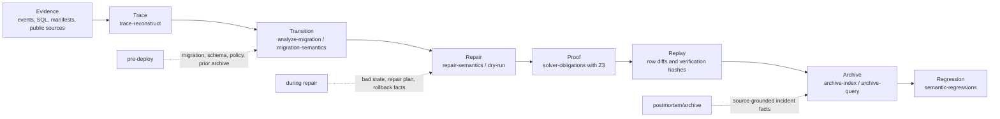

# Patchline semantic pipeline

Patchline's artifact story is a pipeline from public or local evidence to reusable semantic memory.

## Stage-to-command map

| Stage | Current command | Artifact emitted | Phase |
| --- | --- | --- | --- |
| Evidence | `historical-failures`, `ingest-evidence`, `extract-sql` | source-grounded observations and event graphs | postmortem, during migration |
| Trace | `trace-reconstruct` | projection hash and event ordering summary | during migration |
| Transition | `analyze-migration`, `migration-semantics` | risk report, statement effects, schema semantics | pre-deploy |
| Repair | `repair-semantics`, `dry-run` | step trace, row diffs, repair hash | during repair |
| Proof | `solver-obligations` | Z3-backed obligation report or explicit downgrade | during repair |
| Replay | `repair-outcomes` | dry-run/applied SQL/verification/rollback history | during repair, archive |
| Archive | `archive-index`, `archive-query` | deterministic incident index and query hashes | archive-only |
| Regression | `semantic-regressions` | recurrence candidates and learned invariants | archive-only |

## Reviewer contract

The artifact path should never require a reviewer to infer which layer a command belongs to. Every runnable demonstration should identify:

1. input artifacts,
2. phase,
3. command,
4. emitted hash or result file,
5. claim supported by that result.
